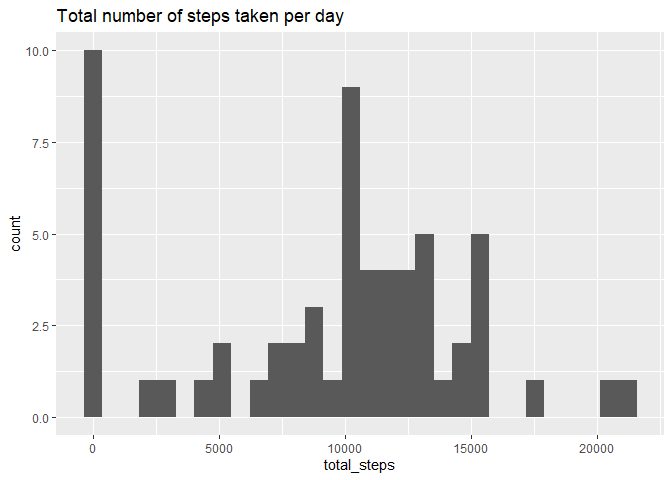
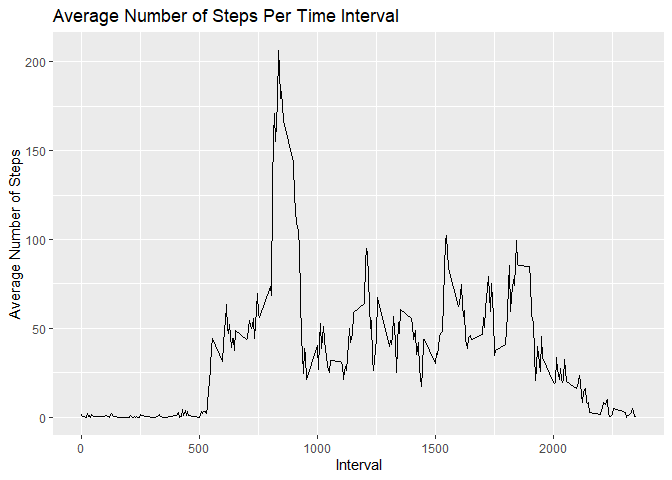
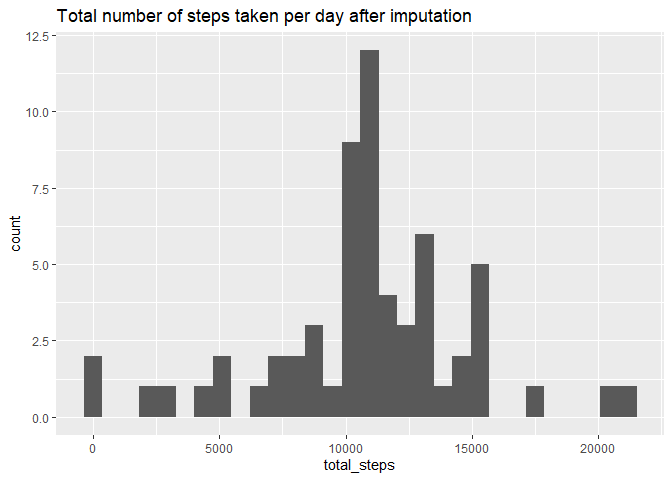
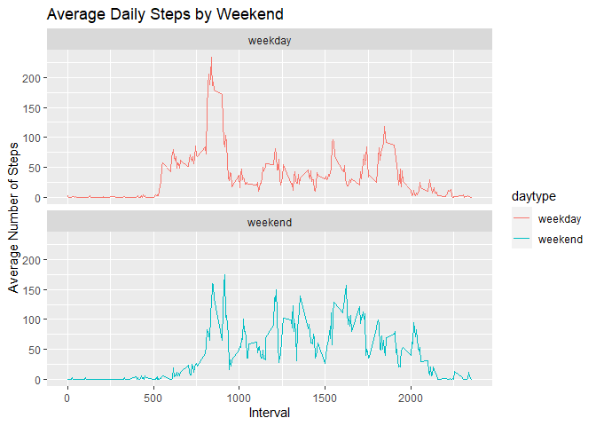

## Course Project 1.

1.  Code for reading in the dataset and/or processing the data

2.  Histogram of the total number of steps taken each day

3.  Mean and median number of steps taken each day

4.  Time series plot of the average number of steps taken

5.  The 5-minute interval that, on average, contains the maximum number
    of steps

6.  Code to describe and show a strategy for imputing missing data

7.  Histogram of the total number of steps taken each day after missing
    values are imputed

8.  Panel plot comparing the average number of steps taken per 5-minute
    interval across weekdays and weekends

9.  All of the R code needed to reproduce the results (numbers, plots,
    etc.) in the report

## 1. Code for reading in the dataset and/or processing the data


Exploring the basics of this data


```r
dim(df_activity)
```

```
## [1] 17568     3
```

```r
names(df_activity)
```

```
## [1] "steps"    "date"     "interval"
```

```r
str(df_activity)
```

```
## 'data.frame':	17568 obs. of  3 variables:
##  $ steps   : int  NA NA NA NA NA NA NA NA NA NA ...
##  $ date    : chr  "2012-10-01" "2012-10-01" "2012-10-01" "2012-10-01" ...
##  $ interval: int  0 5 10 15 20 25 30 35 40 45 ...
```

```r
#transform date column into date format
df_activity$date<-ymd(df_activity$date)
```


```r
head(df_activity)
```

```
##   steps       date interval
## 1    NA 2012-10-01        0
## 2    NA 2012-10-01        5
## 3    NA 2012-10-01       10
## 4    NA 2012-10-01       15
## 5    NA 2012-10-01       20
## 6    NA 2012-10-01       25
```

## 2. Histogram of the total number of steps taken each day

Group the data by day, then sum the steps per day


```r
stepsPerDay<- df_activity %>% 
    group_by(date) %>% 
    summarize(total_steps = sum(steps,na.rm = TRUE))
stepsPerDay
```

```
## # A tibble: 61 × 2
##    date       total_steps
##    <date>           <int>
##  1 2012-10-01           0
##  2 2012-10-02         126
##  3 2012-10-03       11352
##  4 2012-10-04       12116
##  5 2012-10-05       13294
##  6 2012-10-06       15420
##  7 2012-10-07       11015
##  8 2012-10-08           0
##  9 2012-10-09       12811
## 10 2012-10-10        9900
## # … with 51 more rows
```

Plot a histogram for total number of steps taken per day


```r
ggplot(stepsPerDay,aes(x=total_steps))+geom_histogram()+ggtitle("Total number of steps taken per day")
```

<!-- -->

## 3.Mean and median number of steps taken each day

Calculate the mean steps taken per day


```r
mean(stepsPerDay$total_steps,na.rm=TRUE)
```

```
## [1] 9354.23
```

Calculate the median steps taken each day


```r
median (stepsPerDay$total_steps,na.rm=TRUE)
```

```
## [1] 10395
```

## 4.Time series plot of the average number of steps taken

Group the steps by interval, then compute the mean steps per time
interval throughout the day. display the average steps per time
interval.


```r
# Group by interval then compute the average steps
stepsByInterval<- df_activity %>% 
    group_by(interval) %>% 
    summarize(average_steps = mean(steps,na.rm = TRUE))


ggplot(stepsByInterval, mapping = aes(x=interval, y=average_steps)) + 
  geom_line() +
  xlab("Interval") + 
  ylab("Average Number of Steps") + 
  ggtitle("Average Number of Steps Per Time Interval")
```

<!-- -->

## 5. The 5-minute interval that, on average, contains the maximum number of steps

compute the 5-minute interval with the maximum number of steps from the
mean steps per interval above.


```r
# Get the index with the max steps
index <- which.max(stepsByInterval$average_steps)

# Get the interval using the index
stepsByInterval[index,]$interval
```

```
## [1] 835
```

## 6. Code to describe and show a strategy for imputing missing data

Check the total missing data, check the column with the missing data.


```r
colSums(is.na(df_activity))
```

```
##    steps     date interval 
##     2304        0        0
```

Next, fill in all the missing values in the dataset with the mean per
interval by looping through the missing steps. The dataset
stepsByInterval above contains average steps per interval.


```r
df_activity_impute <- df_activity
for(i in 1:nrow(df_activity_impute)){
    if(is.na(df_activity_impute[i,]$steps)){
        df_activity_impute[i,]$steps <- filter(stepsByInterval, interval==df_activity_impute[i,]$interval)$average_steps
    }
}
```

Check the result of the imputation.


```r
colSums(is.na(df_activity_impute))
```

```
##    steps     date interval 
##        0        0        0
```

## 7. Histogram of the total number of steps taken each day after missing values are imputed

Compute the steps per day after imputation.


```r
stepsPerDay_imputed<- df_activity_impute %>% 
    group_by(date) %>% 
    summarize(total_steps = sum(steps,na.rm = TRUE))
stepsPerDay_imputed
```

```
## # A tibble: 61 × 2
##    date       total_steps
##    <date>           <dbl>
##  1 2012-10-01      10766.
##  2 2012-10-02        126 
##  3 2012-10-03      11352 
##  4 2012-10-04      12116 
##  5 2012-10-05      13294 
##  6 2012-10-06      15420 
##  7 2012-10-07      11015 
##  8 2012-10-08      10766.
##  9 2012-10-09      12811 
## 10 2012-10-10       9900 
## # … with 51 more rows
```

Plot a histogram of the total number of steps taken each day after
imputation.


```r
ggplot(stepsPerDay_imputed,aes(x=total_steps))+geom_histogram()+ggtitle("Total number of steps taken per day after imputation")
```

<!-- -->

## 8. Panel plot comparing the average number of steps taken per 5-minute interval across weekdays and weekends

Use wday from lubridate to check the day of the week for each of the row
and set it to a new variable 'wday'. the value wday will be 1 for Sunday
and 7 for Saturday. Then add another variable 'weekend', which will be
TRUE if the day falls on weekend.


```r
# use wday to check the week of the day
df_activity$wday <- wday(df_activity$date)

# Add a new column weekend for wday 1(Sunday) and 7 (Saturday)
df_activity<- df_activity %>% 
    mutate(daytype = case_when(wday %in% c(1,7)~'weekend',
                               wday %in% c(2,3,4,5,6)~'weekday' ))
```

Group the steps by interval


```r
# Group by interval then compute the average steps
stepsByInterval_dayType<- df_activity %>% 
    group_by(interval,daytype) %>% 
    summarize(average_steps = mean(steps,na.rm = TRUE))

head(stepsByInterval_dayType)
```

```
## # A tibble: 6 × 3
## # Groups:   interval [3]
##   interval daytype average_steps
##      <int> <chr>           <dbl>
## 1        0 weekday         2.33 
## 2        0 weekend         0    
## 3        5 weekday         0.462
## 4        5 weekend         0    
## 5       10 weekday         0.179
## 6       10 weekend         0
```

Construct a panel plot containing a time series plot of 5 minutes
interval and the average steps taken, averaged across all weekdays and
weekend.


```r
ggplot(stepsByInterval_dayType, aes(x = interval , y = average_steps, color = daytype)) + 
  geom_line() + ggtitle("Average Daily Steps by Weekend") + 
  xlab("Interval") + 
  ylab("Average Number of Steps") +
  facet_wrap(~daytype, ncol = 1, nrow=2) 
```

<!-- -->
